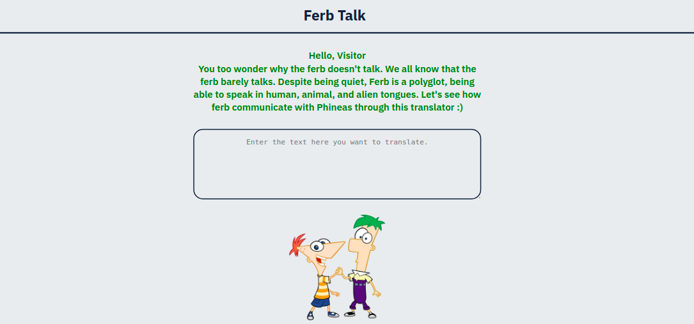

<h1 align="center">Ferb - Latin</h1>

Ferb-Latin is a translation app to convert English to Ferb Latin, created using a [funtranslations.com](https://funtranslations.com/ferb-latin) API. During their routine summer fun, the two brothers Phineas and Ferb(in a Dinsney series) create their own language, Ferb Latin.

<br>



### Tech Stack:

* HTML5
* CSS
* Javascript

### Get the latest version of the project:

```bash
$ git clone https://github.com/piyushahir28/Ferb-Talk.git
$ code Ferb-Talk
```

#### Link to the [Web App](https://ferbtalk-piyushahir28.netlify.app/)